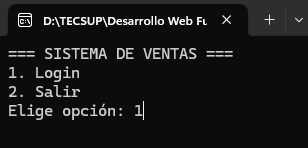
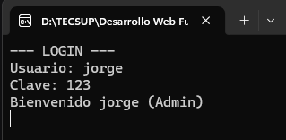
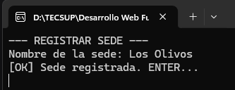
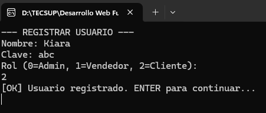
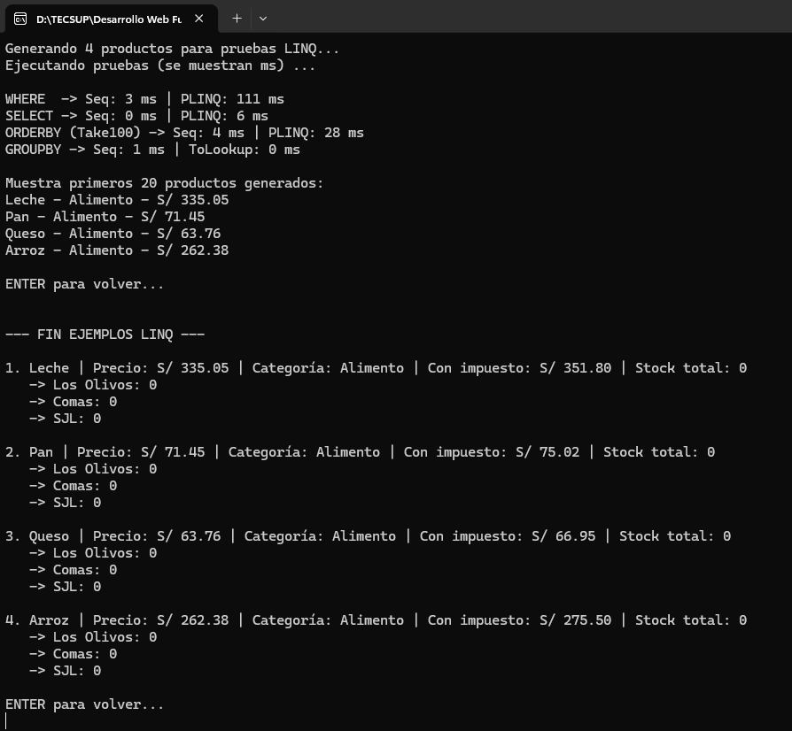
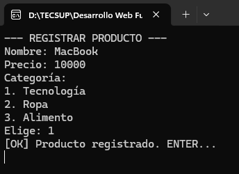
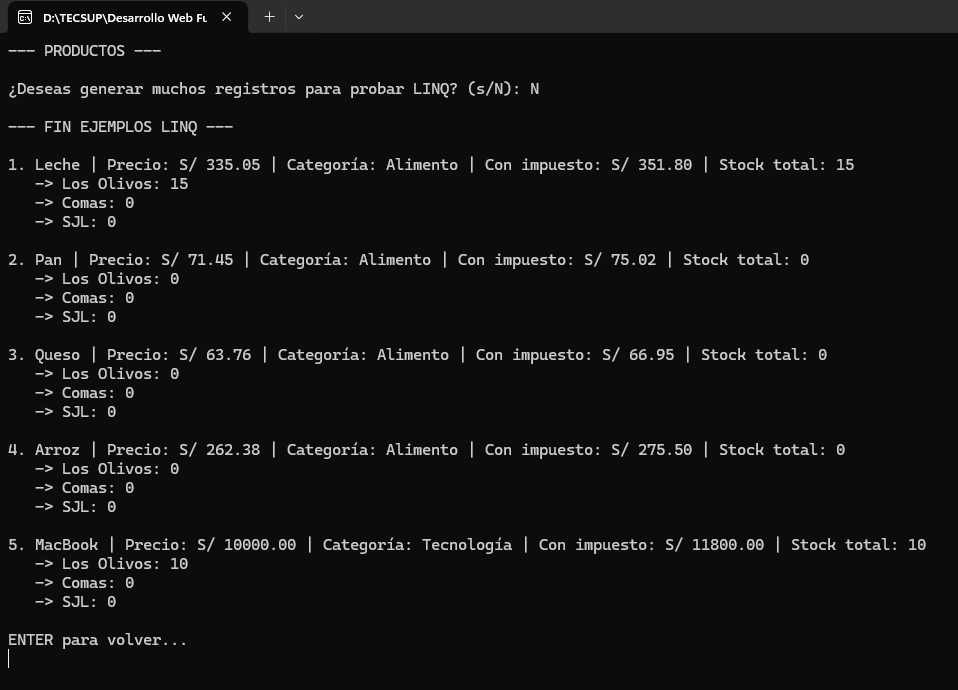
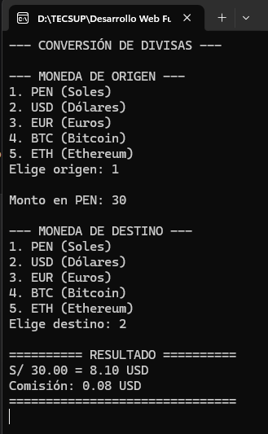
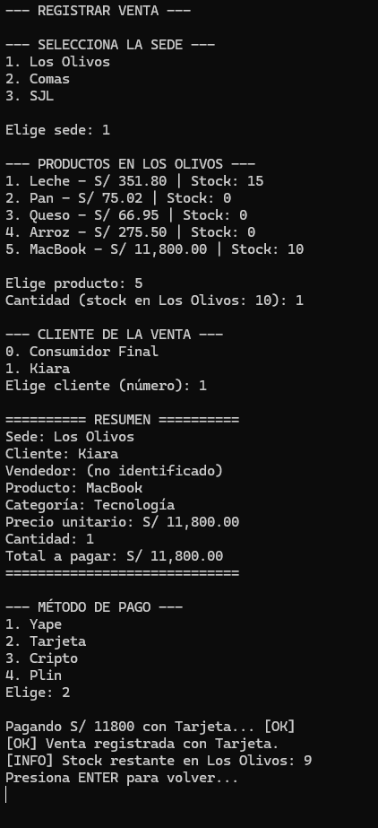

# 🛒 SISTEMA DE VENTAS

Bienvenido al **Sistema de Ventas**, una aplicación de consola (CLI) diseñada para la gestión integral de sedes, usuarios, productos, inventario, conversión de divisas y registro de ventas. 

Este documento sirve como **Manual de Usuario** para interactuar correctamente con todas las funcionalidades del sistema.

---

## 🚀 Inicio Rápido

Al ejecutar el sistema, se te presentará el menú principal de acceso:

Selecciona la opción 1 para ingresar al sistema.

```text
=== SISTEMA DE VENTAS ===
1. Login
2. Salir
Elige opción:
```
<p align="center">
  
</p>

## 🧭 Ingresa tu Usuario y Clave.

Si las credenciales son correctas, verás un mensaje de bienvenida indicando tu rol (ej. Bienvenido jorge (Admin)).

<p align="center">
  
</p>

```text
=== MENÚ (Admin) ===

--- CONFIGURACIÓN ---
1. Registrar sede
2. Registrar usuario
3. Registrar producto
4. Agregar stock a sede

--- OPERACIÓN ---
5. Ver productos
6. Convertir divisas
7. Registrar venta

--- SESIÓN ---
0. Cerrar sesión

Elige opción:
```
## ⚙️ Guía de Funcionalidades
```text
1. Registrar Sede
Permite dar de alta una nueva ubicación o sucursal en el sistema.

Instrucción: Selecciona la opción 1, ingresa el nombre de la sede (ej. Los Olivos, Breña) y presiona ENTER.

Resultado: [OK] Sede registrada.
```
<p align="center">
  
</p>

```text
2. Registrar Usuario
Crea nuevos accesos al sistema con distintos niveles de permisos.

Instrucción: Selecciona la opción 2, ingresa el Nombre, la Clave y el Rol.

Roles disponibles:

0 = Admin (Administrador total)

1 = Vendedor (Acceso a ventas)

2 = Cliente (Acceso a compras)

Resultado: [OK] Usuario registrado.
```

<p align="center">
  
</p>

```text
3. Ver Productos
Muestra el catálogo completo con información detallada.

Instrucción: Selecciona la opción 5. El sistema preguntará si deseas generar muchos registros para probar LINQ (responde N para uso normal o S para pruebas de rendimiento).

Información mostrada:

Nombre, Precio base y Categoría.

Precio con impuesto calculado automáticamente.

Stock total y desglose de stock por cada sede.

Nota: Incluye un módulo de benchmarking (LINQ) que muestra tiempos de ejecución en milisegundos (ms) para consultas WHERE, SELECT, ORDERBY y GROUPBY.
```

<p align="center">
  
</p>

```text
4. Registrar Producto
Añade nuevos artículos al catálogo general.

Instrucción: Selecciona la opción 3, ingresa el Nombre, Precio y selecciona la Categoría.

Categorías disponibles:

Tecnología
Ropa
Alimento
Resultado: [OK] Producto registrado.
```

<p align="center">
  
</p>

```text
5. Ver Productos
Muestra el catálogo completo con información detallada.

Instrucción: Selecciona la opción 5. El sistema preguntará si deseas generar muchos registros para probar LINQ (responde N para uso normal o S para pruebas de rendimiento).
```

<p align="center">
  
</p>

```text
6. Convertir Divisas
Realiza conversiones de moneda en tiempo real con cálculo de comisiones.

Instrucción: Selecciona la opción 6.

Paso 1: Elige la moneda de origen (PEN, USD, EUR, BTC, ETH).

Paso 2: Ingresa el monto a convertir.

Paso 3: Elige la moneda de destino.

Resultado: El sistema muestra el monto convertido y la comisión aplicada (ej. S/ 30.00 = 8.10 USD | Comisión: 0.08 USD).
```

<p align="center">
  
</p>

```text
7. Registrar Venta
Es el flujo principal de negocio. Permite facturar productos descontando stock automáticamente.

Instrucción: Selecciona la opción 7 y sigue el asistente paso a paso:

Selecciona la Sede: Elige la sucursal donde se realiza la venta.
Selecciona el Producto: El sistema mostrará solo los productos con stock disponible en esa sede, indicando el precio final (con impuesto).
Cantidad: Ingresa cuántas unidades se llevará el cliente (el sistema valida que haya stock suficiente).
Cliente: Selecciona 0 para Consumidor Final o el número del cliente registrado (ej. 1. Kiara).
Resumen: El sistema muestra un resumen detallado de la venta (Sede, Cliente, Vendedor, Producto, Precio Unitario, Cantidad y Total).
Método de Pago: Selecciona la forma de pago:
Yape
Tarjeta
Cripto
Plin
Resultado: [OK] Venta registrada con [Método]. [INFO] Stock restante en [Sede]: X
```

<p align="center">
  
</p>

```text
8. Cerrar Sesión
Instrucción: Selecciona la opción 0 para salir de tu cuenta de usuario de forma segura y volver al menú de Login principal.
```
